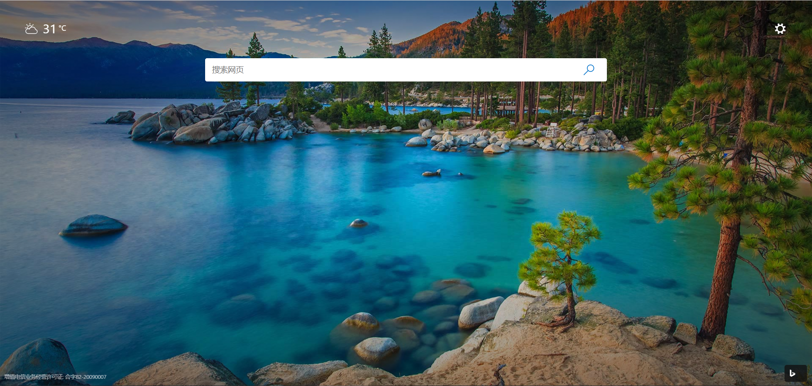
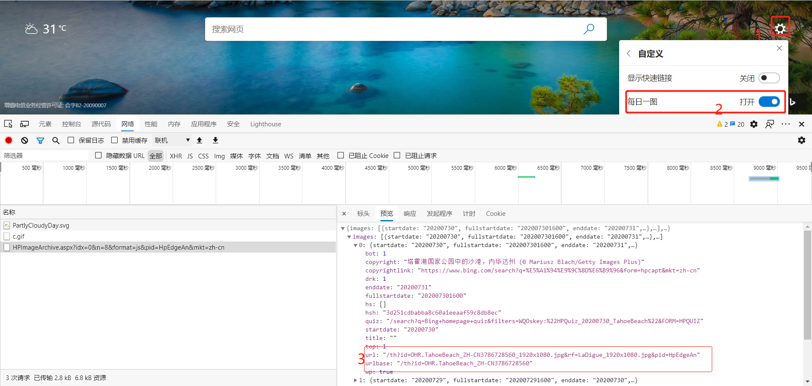
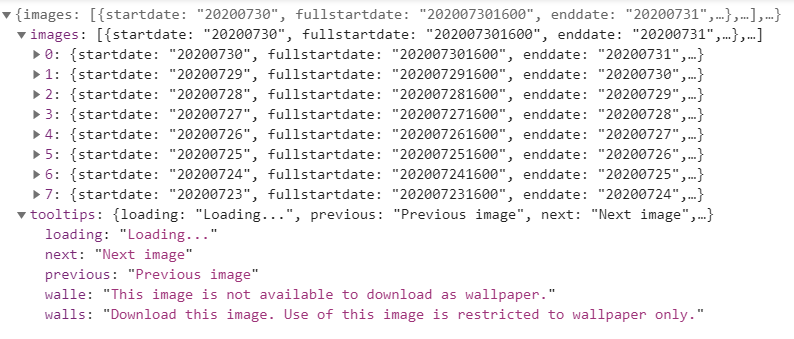

# Download-Edge-Backgroud
# 下载 Edge 背景图片
Download Edge Backgroud
下载 Edge 新页面 背景图片


## TODO

- [x] download
- [ ] UI
- [ ] auto set desktop backgroud

## F12查看数据
页面设置按钮-每日一图
开关一下
看到控制台数据
原来是json

## json 分析
数组中嵌入字典结果


一级结构

```python 
[{},{}]
```
```python 
{
bot: 1
copyright: "塔霍湖国家公园中的沙港，内华达州 (© Mariusz Blach/Getty Images Plus)"
copyrightlink: "https://www.bing.com/search?q=%E5%A1%94%E9%9C%8D%E6%B9%96&form=hpcapt&mkt=zh-cn"
drk: 1
enddate: "20200731"
fullstartdate: "202007301600"
hs: []
hsh: "3d251cdbabba8c60a1eeaaf59c8db8ec"
quiz: "/search?q=Bing+homepage+quiz&filters=WQOskey:%22HPQuiz_20200730_TahoeBeach%22&FORM=HPQUIZ"
startdate: "20200730"
title: ""
top: 1
url: "/th?id=OHR.TahoeBeach_ZH-CN3786728560_1920x1080.jpg&rf=LaDigue_1920x1080.jpg&pid=HpEdgeAn"
urlbase: "/th?id=OHR.TahoeBeach_ZH-CN3786728560"
wp: true
}
```

[操作说明](https://www.zhihu.com/question/383049984/answer/1373592059)

